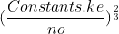
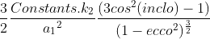
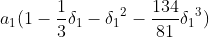
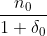
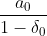

## SGP4
### What is TLE?
TLE is a **T**wo **L**ine **E**lement giving data that allows for the calculation of speed and position of a satellite
at any given time.

Parameter | Description
------------- | ------- 
**Line 0** |
Name of Satellite | This is the name of the satellite
**Line 1** |
Satellite Number | This is a unique identification id
Classification (U/C/S) | U = Unclassified, C = Classified, S = Secret
Epoch Year | Last 2 numbers of the year this TLE data was made
Julian Date Fraction | The number of days into the epoch year of which the TLE was made
Ballistic Coefficient | The change of velocity per day divided by 2
Second Derivative of Mean Motion | Also change in velocity per day divided by 6
Drag Term | This is the radiation pressure coefficient
Element Set Number | Number of times TLE is generated for this satellite
**Line 2** |
Inclination | The angle between the equator and the orbital plane
Right Ascension of the Ascending Node | The angle between a reference direction (vernal equinox) and the orbital plane
Eccentricity | Defines the shape of the orbit, 0 = circular, 0-1 = elliptical
Argument of Perigee | Angle between ascending node and closest point to earth
Mean Anomaly | The angle between the periapsis and where the object is now
Mean Motion | Average number of revolutions per day
Revolution Number | Total number of revolutions at epoch
 | *Retrieved 6 May 2020*
### What is SGP4?
SGP4 is a simplified general perturbations model. It applies to near earth objects with an orbital period of less than **225** minutes.
It is used to calculate orbital state vectors of satellites and space debris.
### How do we calculate this SGP4-thing?
#### At creation of a `TLEData` object, we do some first calculations:
*See [CONSTANTS.md](CONSTANTS.md#static-fields) for more info on the Constants referenced below*

Variable name | Value
------------- | -----
α1 | 
δ1 | 
α0 | 
δ0 | 
n"0 | 
α"0 | 

#### When the `sgp4(time)`-method is called:
*Here we calculate the rest of the algorithm with the desired time parameter*

#### Sources:
* [SPACETRACK REPORT NO. 3](http://celestrak.com/NORAD/documentation/spacetrk.pdf) *Retrieved 6 May 2020*
* [Online LaTeX editor](https://www.codecogs.com/latex/eqneditor.php) *Retrieved 6 May 2020*
* [Simplified perturbations models](https://en.wikipedia.org/wiki/Simplified_perturbations_models) *Retrieved 6 May 2020*